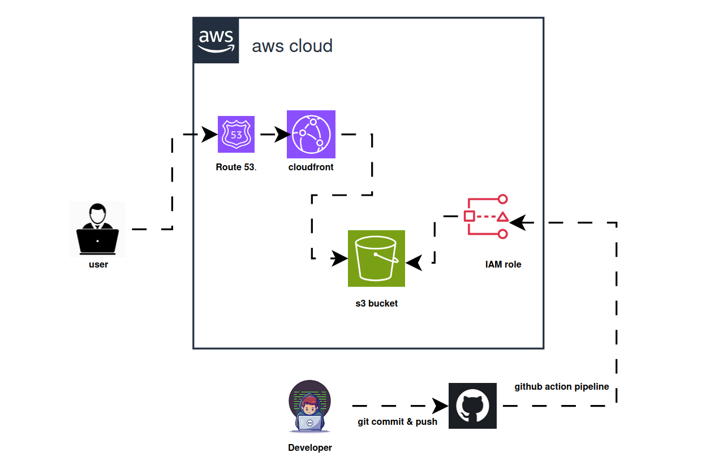

```markdown
# Serverless Static Website CI/CD Pipeline

[](https://aws.amazon.com/s3/)
[](https://aws.amazon.com/cloudfront/)
[](https://github.com/features/actions)
[](https://www.terraform.io/)

A production-ready, fully automated serverless hosting platform built using **Infrastructure as Code (IaC)** with HCP Terraform and a continuous deployment pipeline via **GitHub Actions**. Static websites are hosted securely on **Amazon S3** and delivered globally via **Amazon CloudFront** using Origin Access Control (OAC).

---

## 🏗️ Architecture Overview


---

### Technical Features

* **Secure OAC Architecture:** Enforces strict public access blocks on S3; all traffic routes securely through CloudFront using Origin Access Control (OAC).
* **Automated IaC & CI/CD:** Provisions and manages infrastructure via Terraform cloud workspaces, paired with GitHub Actions to automate code deployment on every push to `main`.
* **Global Low-Latency CDN:** Integrated Amazon CloudFront CDN with automated edge cache invalidation (`/*`) ensuring updates propagate worldwide instantly.
* **Secure State Management:** Stores Terraform state remotely on HashiCorp Cloud Platform (HCP Terraform) with encrypted token authentication.

---

## 📁 Repository Structure

```text
serverless-website-cicd/
├── .github/
│   └── workflows/
│       └── deploy.yml        # GitHub Actions CI/CD workflow configuration
├── terraform/                # Terraform configuration files (main, variables, outputs, providers)
├── asset/                    # Local assets for documentation (excluded from deployment)
├── .gitignore                # System, environment, and personal file exclusions
└── index.html                # Static website source code

```

---

## 🚀 Step-by-Step Deployment Process

### Prerequisites

1. An active **AWS Account** with programmatic access keys.
2. An active **HCP Terraform Account** with a configured remote workspace and API token.

---

### Setup Instructions

1. **Clone the Repository:**
```bash
git clone git@github.com:YOUR-USERNAME/serverless-website-cicd.git
cd serverless-website-cicd

```


2. **Add Your Website Files:**
* Place or edit your `index.html` and any static assets (like CSS, JavaScript, or custom images) directly into the root directory of your cloned repository.


3. **Configure GitHub Repository Secrets:**
Navigate to **Settings > Secrets and variables > Actions** in your GitHub repository and add the following required secrets:
* `AWS_ACCESS_KEY_ID`: Your AWS IAM access key.
* `AWS_SECRET_ACCESS_KEY`: Your AWS IAM secret access key.
* `TF_API_TOKEN`: Your HCP Terraform user or team API token for remote state management.


4. **Deploy Changes:**
Commit and push your configuration to the `main` branch to trigger the automated CI/CD pipeline:
```bash
git add .
git status 
git commit -m "setup automated deployment pipeline"
git push -u origin main

```


5. **Access Your Website:**
Your website's CloudFront CDN URL will be outputted in the GitHub Actions terminal upon completion. Any subsequent updates pushed to `main` will automatically update the files in S3 and clear the CloudFront cache within minutes.

---

## 👤 Author

**Stephen Oni**

*Cloud Infrastructure & DevOps Engineer*

* **Portfolio:** [stephenoni.mytunnel.org](https://www.google.com/search?q=http://stephenoni.mytunnel.org)
* **LinkedIn:** [stephen-omololu](https://www.google.com/search?q=https://linkedin.com/in/stephen-omololu)

---

## 📄 License

This project is open-source and available under the [MIT License](https://www.google.com/search?q=LICENSE).

```

```